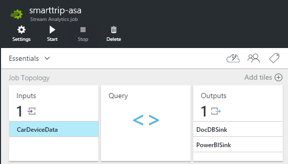
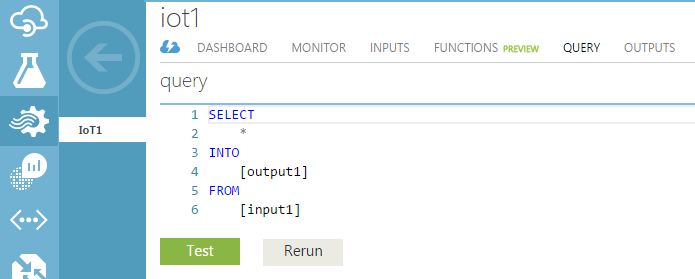
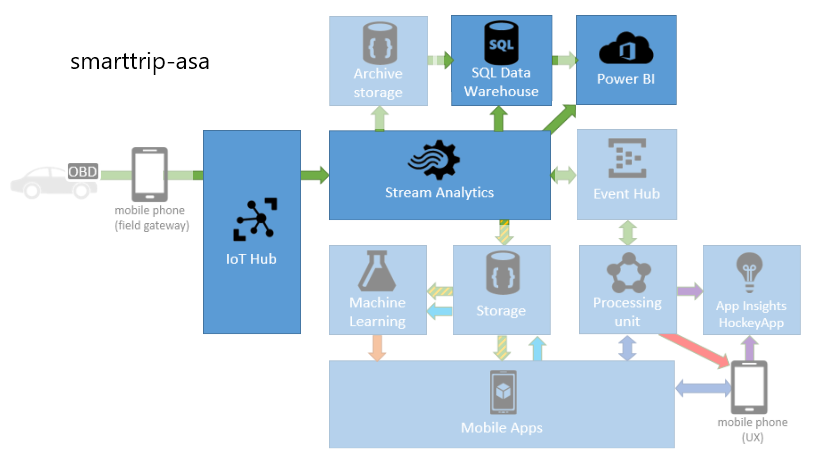
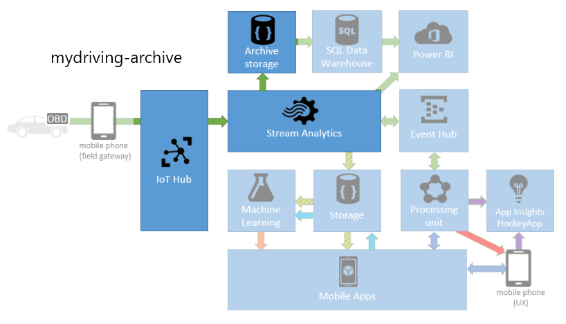

# Backend data paths


## Primer: Stream Analytics

[Azure Stream Analytics](https://azure.microsoft.com/documentation/articles/stream-analytics-introduction/) performs fast processing of data streaming from anywhere - devices, sensors, and the web. You use a SQL-like language to express real-time data transformations over the incoming data. You can filter, join, aggregate, and transform data. Results are continuously streamed to the sinks you specify. Like other Azure services, it's hugely scaleable, secure and reliable.

Typical applications aggregate and filter data coming in from devices or the web, and might combine it with static data. 


Streaming architectures contrast sharply with a more traditional approach in which incoming data is loaded immediately into a database, which is then queried by user apps. Updating the database is cumbersome, and it can be minutes before the critical queries can be performed on the uploaded data.

In a streaming solution, the critical queries are processed continuously as they arrive, and passed on to a suitable sink. The inputs and outputs directly connected to Stream Analytics are typically queues, stores or databases, with which other apps and services can work at their own rate. 


## Connecting up Stream Analytics

A Stream Analytics jobb is very simple: it has some inputs, some processing code written like SQL queries, and some outputs. Here's what a Stream Analytics job looks like in the Azure portal:



The inputs and outputs are other Azure services. It's easiest to set up those services first, then connect a Stream Analytics job between them. To plug them into Stream Analytics, you just add a new input or output definition, and then copy across the relevant keys and IDs. There is a variety of adapters for coupling to different types of inputs and outputs.

Inputs can be sourced from several types of service:

* **[IoT Hub](https://azure.microsoft.com/documentation/articles/event-hubs-what-is-event-hubs/)**: Gathers data from external devices, with secure validated two-way connections. In our demo app, that's how we get data from the devices.
* **[Event Hub](https://azure.microsoft.com/documentation/services/event-hubs/)**: Can accept data from devices at high volume, though without identifying individual devices. Event hubs have a wider application as high-volume buffers between co-located Azure services. They can be connected both as inputs and outputs to Stream Analytics.
* **[Blob Storage](https://azure.microsoft.com/documentation/articles/storage-introduction/#blob-storage)**: Used for large amounts of unstructured data. As an input, blob storage is typically used to join relatively static or 'cold path' data into Stream Analytics queries.

Outputs can sink to:

* **[Blob storage](https://azure.microsoft.com/documentation/services/storage/#blob-storage)**: Output is stored as a series of timestamped chunks. 
* **[Document DB](https://azure.microsoft.com/documentation/services/documentdb/)**: NoSQL database for storing JSON data without a schema.
* **[SQL database](https://azure.microsoft.com/documentation/services/sql-database/)**: Build and update tables.
* **[Power BI](https://azure.microsoft.com/documentation/articles/stream-analytics-power-bi-dashboard/)**: Output can be used directly to display charts and tables.
* **[Event Hub](https://azure.microsoft.com/documentation/articles/event-hubs-what-is-event-hubs/)**: A high-volume buffer to co-located Azure services.  
* **[Service Bus](https://azure.microsoft.com/documentation/services/service-bus/)** Queues and Topics can also be used as buffers to other processes. These handle somewhat less volume than event hubs, but have more facilities for coupling to and from processes outside Azure or at other locations.

The third piece of a Stream Analytics job is the Query: the code that transforms the inputs into the outputs.

## Queries in Stream Analytics

[Stream Analytics queries](https://msdn.microsoft.com/library/azure/dn834998.aspx) look superficially like conventional SQL queries, but there are some important differences. In particular:

* The FROM and INTO clauses of a SELECT statement can reference input and output connections that you have set up. A query can have more than one of each.
* A Stream Analytics job runs continuously until you stop it, and its queries are running continuously in parallel.
* Nevertheless, there's a Test function that allows you to run a query over a finite input table.
* No schema is required. Stream Analytics works with whatever it finds in the inputs. You can use path notation to access the fields of structured data, such as `Trip.StartPoint.Latitude`.
* The query language has some constructs concerned with timing. For example, there's a LAG expression that compares the current record with previous ones.
* There's no equivalent of aggregating over a whole database, but you can aggregate over arbitrary periods of time. For example, to average a value over successive periods of 10 seconds:

    ```

      SELECT AVG(speed) as avg_speed
      GROUP BY TumblingWindow(second, 10)
    ```


This query passes records straight from an input stream to an output:

```

    SELECT *
    INTO OutputStream1
	FROM InputStream1
```

A more typical query structure separates into selecting the input fields and then computing the outputs;

```

   WITH Data AS 
   ( SELECT speed, rpm FROM CarInputData) 
 
   SELECT speed, rpm,  speed/rpm as gear FROM DATA INTO PBIoutput
```

## Testing queries

You don't have to test your queries on continuously streaming data. Instead, the Test feature lets you upload sample data and run on that.
(Here's [a sample](https://raw.githubusercontent.com/Azure/azure-stream-analytics/master/Samples/GettingStarted/HelloWorldASA-InputStream.json).) 

At present, you have to use the [older version of the Azure portal](https://manage.windowsazure.com) to run the tester. It gives you access to all the same resources and data, but with a different user interface.



Try these experiments:

#### Filter

Add a WHERE clause:

```

     SELECT *
     INTO OutputStream1
   	 INPUT InputStream1
     WHERE dspl='sensorA'
```

#### Rename and project fields

```

    SELECT 
      time,
      dspl AS SensorName
      temp AS Temperature
     INTO OutputStream1
   	 INPUT InputStream1
     WHERE dspl='sensorA'
```

#### Moving average

    SELECT
      System.Timestamp AS OutputTime,
      dspl AS SensorName,
      Avg(temp) AS AvgTemp
    INTO
      OutputStream1
    FROM
      InputStream1 TIMESTAMP By time
    GROUP BY TumblingWindow(second, 60), dspl
 

* `TIMESTAMP` identifies the `time` field as the time over which to perform the tumbling window average.
* `TumblingWindow` groups the records into successive intervals of the given period.


#### Self-join

This query creates two aliases `t1` and `t2` for a single input stream, and performs a join between the two. Where there is a record from a particular sensor that is not matched by another record within 60 seconds, the query generates an output row.

    SELECT
      t1.time,
      t1.dspl AS SensorName
    INTO
      output
    FROM
      InputStream1 t1 TIMESTAMP BY time
    LEFT OUTER JOIN
      InputStream1 t2 TIMESTAMP BY time
    ON
      t1.dspl=t2.dspl AND
      DATEDIFF(second, t1, t2) BETWEEN 1 and 60
    WHERE t2.dspl IS NULL

The query therefore generates an output when no data has been received from a previously live sensor for the past minute.

#### More examples

[Find more query examples here](https://azure.microsoft.com/documentation/articles/stream-analytics-stream-analytics-query-patterns/).


## Where should Stream Analytics be used?


Stream Analytics is applicable wherever a continuous stream of data has to be processed. Typical applications include:

* Monitoring machinery or environment - as in the present example
* Continuous processing with a cloud backend
* Application telemetry - finding faults, summarizing usage


## Best practices for Stream Analytics

* Run Stream Analytics in the same geo location as the other components, so as to minimise long-distance traffic and latency. In particular, output storage should be co-located. 

## Scaling

[Monitoring metrics](http://blogs.msdn.com/b/streamanalytics/archive/2015/06/29/intro-to-diagnostics-for-azure-stream-analytics.aspx) are surfaced in Monitor tab of the Azure Stream Analytics Job. The main metrics show counts of input events, and error counts. As with other Azure metrics, you can set alerts so that you receive an email any metric goes above a threshold you set. 

As your traffic increases, you can [scale up](https://azure.microsoft.com/documentation/articles/stream-analytics-scale-jobs/) the power of your Stream Analytics job, in units of about 1Mb/s of throughput per query step. You can also set up multiple event hubs and stream analytics units in  parallel-running partitions. 

## How Stream Analytics is used in the demo

In our demo application, we use Stream Analytics to process data received from ODB devices and cell phones connected through IoT Hub. The task of Stream Analytics is to reshape the data to actionable forms in which it can be sent on to the mobile app, machine learning, and service monitoring.


In our demo, Stream Analytics jobs provide is the key pipelines for the major data paths.


# Azure storage

We use [Azure cloud storage](https://azure.microsoft.com/documentation/articles/storage-introduction/) as a medium to long term store for raw and analysed data in our dataflows. It gives the option of storing in a variety of formats as blobs, tables, queues or files. It's massively scalable - you can use as little or as much as you want, and pay only for the data you store. 

Available formats are:

* Blobs - for unstructured data such as documents or media. This is what we use for Stream Analytics input and output.
* Tables - for NoSQL data (structured without a schema)
* Queues - for messages typically consumed in order
* Files - for old applications, requiring no code changes

It's easy to create storage in Azure:


You need the storage access id and key:


In a separate browser window (so that you can copy the key), open your Stream Analytics, create a new input or output, and supply the keys:


You can download the content of the store from the Azure portal, or use one of the many apps and plug-ins that can be found.

# Paths

## SmartTrip-ASA

This path moves 5-second aggregates of the raw data into the archive NoSQL database and Power BI. Every 5 seconds, the following are computed: 

* Average longitude and latitude
* Average, maximum and minimum speed
* Max throttle (called 'average' - bug??)
* Max engine speed and average engine load (only in db - bug???)




### Inputs and Outputs

* `CarDeviceData` - the input stream from the IOT Hub
* `DocDBSink` - the NoSQL database
* `PowerBISink` - PowerBI

### Query

```SQL

WITH TripPointRaw as 
(
SELECT
    TripId,
    TripDataPoint.Lat as RawLat,
    TripDataPoint.Lon as RawLong,
    TripDataPoint.Speed as spd,
    TripDataPoint.EngineRPM as rpm,
    TripDataPoint.EngineLoad as engineLoad,
    DATEADD(millisecond,- DATEPART(millisecond,TripDataPoint.RecordedTimeStamp),DATEADD(second, 5 - CAST(CEILING(DATEPART(second, TripDataPoint.RecordedTimeStamp)%5) as BIGINT),TripDataPoint.RecordedTimeStamp)) as ts,
    TripDataPoint.VIN as vin,
    TripDataPoint.RelativeThrottlePosition as throttle
FROM
    CarDeviceData
WHERE
    TripId is not null
    and TripId != ''
)

SELECT
    CONCAT(TripId,':',DATENAME(year,ts),'-',DATENAME(month,ts),'-',DATENAME(day,ts),'-',DATENAME(hour,ts),'-',DATENAME(minute,ts),'-',DATENAME(second,ts)) as DocId,
    TripId,
    vin,
    ts,
    AVG(RawLat) as lat,
    AVG(RawLong) as lon,
    AVG(CAST(spd as FLOAT)) as avgSpeed,
    MAX(CAST(spd as FLOAT)) as maxSpeed,
    MIN(CAST(spd as FLOAT)) as minSpeed,
    AVG(CAST(engineLoad as FLOAT)) as avgEngineLoad,
    MAX(CAST(rpm as FLOAT)) as maxRpm,
    MAX(CAST(throttle as FLOAT)) as avgThrottle
INTO DocDBSink
FROM
    TripPointRaw
WHERE
    ts is not null
GROUP BY
    TripId,
    vin,
    ts,
    TumblingWindow(second,5)
    
    
SELECT
    TripId,
    vin,
    ts,
    AVG(RawLat) as lat,
    AVG(RawLong) as lon,
    AVG(CAST(spd as FLOAT)) as avgSpeed,
    MAX(CAST(spd as FLOAT)) as maxSpeed,
    MIN(CAST(spd as FLOAT)) as minSpeed,
    MAX(CAST(rpm as FLOAT)) as maxRpm,
    MAX(CAST(throttle as FLOAT)) as avgThrottle
INTO PowerBISink
FROM
    TripPointRaw
WHERE
    ts is not null
GROUP BY
    TripId,
    vin,
    ts,
    TumblingWindow(second,5)


```

## MyDriving-archive

Saves all raw data into the archive blob storage. Performs no processing.





```

SELECT
    TripId,
    Name,
    TripDataPoint.TripPointId as TripPointId,
    TripDataPoint.Lat as Lat,
    TripDataPoint.Lon as Lon,
    TripDataPoint.Speed as Speed,
    TripDataPoint.RecordedTimeStamp as RecordedTimeStamp,
    TripDataPoint.Sequence as Sequence,
    TripDataPoint.EngineRPM as EngineRPM,
    TripDataPoint.ShortTermFuelBank1 as ShortTermFuelBank,
    TripDataPoint.LongTermFuelBank1 as LongTermFuelBank,
    TripDataPoint.ThrottlePosition as ThrottlePosition,
    TripDataPoint.RelativeThrottlePosition as RelativeThrottlePosition,
    TripDataPoint.Runtime as Runtime,
    TripDataPoint.DistancewithMIL as DistancewithMIL,
    TripDataPoint.EngineLoad as EngineLoad,
    TripDataPoint.MAFFlowRate as MAFFlowRate,
    TripDataPoint.OutsideTemperature as OutsideTemperature,
    TripDataPoint.EngineFuelRate as EngineFuelRate,
    TripDataPoint.VIN as vin
INTO
    BlobSink
FROM
    CarDeviceData
WHERE
    TripId is not null
```

## tripsdbstreamingjob


